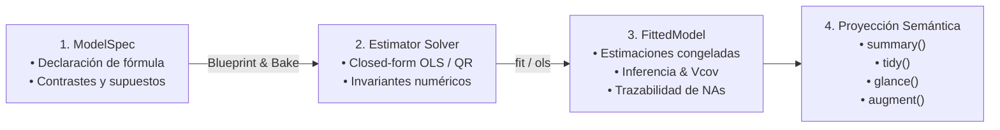

# RFC 11: NEKO — Native Estimation & Kernel Outcomes
## Framework Unificado de Modelado e Inferencia Estadística en GHL

> *"Un buen modelo estadístico debe ser como un gato: ágil, flexible, elegante, silencioso en cómputo y, ante cualquier perturbación numérica, caer siempre de pie."*

---

## 1. Visión y Motivación

Los ecosistemas estadísticos convencionales arrastran vicios arquitectónicos históricos:
* **R:** Inferencia fracturada (`vcov` desconectado de `summary`, métodos S3 desestructurados resueltos en runtime, copias masivas por *copy-on-modify* y opacidad en `na.action`).
* **Python / PyData:** Cisma entre `scikit-learn` (predicciones sin errores estándar ni $p$-valores) y `statsmodels` (APIs heterogéneas, escasa optimización e inconsistencias en preprocesamiento).
* **Julia:** Latencia severa en primer uso (TTFX) por compilación JIT tardía y fragmentación de tipos en runtime.

**GHL** (*Generalized Hypothesis Language* — en honor a **Gojo & Haru**) solventa estos dilemas convirtiendo a los modelos estadísticos en **ciudadanos de primer orden** mediante el framework **NEKO** (*Native Estimation & Kernel Outcomes*).

---

## 2. Desacoplamiento Canónico en Tres Momentos

NEKO divide formalmente la vida de un modelo en tres entidades ortogonales:



1. **`ModelSpec` (Especificación Pura):** Declaración simbólica de variables (`response ~ x1 + x2`), contrastes y estructura (panel, series de tiempo o transversal). No ejecuta cálculos ni consume memoria pesada.
2. **`Blueprint` (Receta Congelada de Transformación):** Aprende la disposición de columnas, resuelve la matriz de diseño $X \in \mathbb{R}^{n \times p}$ y vector respuesta $y \in \mathbb{R}^n$, y preserva el contrato de trazabilidad de filas (`RowDisposition`).
3. **`FittedModel` (Instancia Inmutable Ajustada):** Resultado del solver numérico. Contiene los parámetros $\hat{\beta}$, matrices de covarianza, diagnósticos asintóticos y firma de reproducibilidad.

---

## 3. El Sistema de Capacidades (Contracts)

En NEKO, un modelo no pertenece a una taxonomía rígida de clases; declara **capacidades comprobables**. Cada capacidad es un contrato con obligaciones que el modelo cumple y garantías que el investigador recibe:

| Capacidad | Obligación del Modelo | Garantía para el Usuario / DSL |
| :--- | :--- | :--- |
| **`Summarizable`** | Emite estimaciones, errores estándar, estadísticos $t$ y valores $p$. | `summary(m)` y `tidy(m)` proyectan tablas de inferencia canónicas. |
| **`HasCovariance`** | Dispone de matriz de varianza-covarianza con nombres de términos. | `vcov(m, kind)` permite extraer matrices clásicas o robustas (`HC0`–`HC3`). |
| **`HasLikelihood`** | Provee log-verosimilitud global $\log L$, grados de libertad, AIC y BIC. | `glance(m)` y pruebas de comparación de modelos (LRT) operan con rigor formal. |
| **`Predictable`** | Aplica el `Blueprint` congelado sobre datos nuevos con igual codificación. | `predict(m, newdata)` predice de forma reproducible sin fuga de información. |
| **`Residualizable`** | Calcula valores ajustados $\hat{y}_i$, residuos $e_i$ y disposición de filas. | `augment(m, data)` retorna la tabla original enriquecida fila a fila sin pérdida. |

---

## 4. Trazabilidad de Datos Ausentes (`RowDisposition`)

A diferencia de `na.action` en R (que a menudo descarta silenciosamente índices o produce desalineamientos en vectores de residuos), el `Blueprint` de NEKO garantiza alineamiento posicional estricto de $1:1$ para cada fila original del dataset:

$$\text{RowDisposition}_i = \begin{cases} \text{Included}, & \text{si } y_i \notin \text{NA} \land \forall j, X_{ij} \notin \text{NA} \\ \text{DroppedNA}(\text{col}, \text{reason}), & \text{si hubo ausencia en variable con motivo opcional} \end{cases}$$

El verbo `augment(model, data)` expone esta trazabilidad mediante dos columnas nativas:
- **`.used_in_fit: bool`**: `true` si la fila participó en la estimación de parámetros; `false` si fue descartada.
- **`.na_reason: str`**: `"none"` para observaciones válidas, o la causa semántica exacta (e.g. `"SensorDropout"`, `"NoResponse"`, `"unspecified"`).

---

## 5. Inferencia y Matrices de Covarianza Robustas (`HasCovariance`)

NEKO desacopla la estimación de coeficientes de la fuente de incertidumbre. La función `vcov(m, [kind])` soporta los siguientes estimadores:

1. **Clásica (Homocedástica):**
   $$V_{\text{classical}} = s^2 \cdot (X^T X)^{-1}, \quad \text{donde } s^2 = \frac{\sum e_i^2}{n - p}$$
2. **White / MacKinnon & White (Heterocedástica):**
   $$V_{\text{HC}} = (X^T X)^{-1} \left( \sum_{i=1}^n w_i \cdot X_i^T X_i \right) (X^T X)^{-1}$$
   - **`HC0`**: $w_i = e_i^2$
   - **`HC1`**: $w_i = \frac{n}{n - p} e_i^2$ (corrección por grados de libertad)
   - **`HC2`**: $w_i = \frac{e_i^2}{1 - h_{ii}}$ (ponderado por apalancamiento $h_{ii}$)
   - **`HC3`**: $w_i = \frac{e_i^2}{(1 - h_{ii})^2}$ (aproximación jackknife recomendada)

---

## 6. Verbos Canónicos de Proyección Semántica

```rust
// 1. Ajuste de hipótesis
let model = fit(response ~ sensor + id, df);

// 2. Reporte diagnóstico formal en consola
summary(model);

// 3. Proyección columnar a DataFrame
let estimates_df = tidy(model);

// 4. Métricas de bondad de ajuste (R2, F, AIC, BIC)
let fit_metrics = glance(model);

// 5. Enriquecimiento de observaciones con trazabilidad de NAs
let evaluated_df = augment(model, df);

// 6. Predicción e inferencia
let y_pred = predict(model, test_df);
let resids = residuals(model);
let vcov_mat = vcov(model, "HC3");
```

---

## 7. Taxonomía de Errores y Diagnósticos Empáticos

NEKO adopta los códigos estandarizados de GHL:
* **`[Statistical Error S0101]`**: Matriz singular / colinealidad perfecta ($X^T X$ sin rango completo).
* **`[Statistical Error S0201]`**: Grados de libertad insuficientes ($N \le p$).
* **`[Statistical Warning SW0005]`**: Muestra pequeña ($N < 5$), advirtiendo que los errores asintóticos pueden estar subestimados.
* **`[Statistical Warning SW0301]`**: Multicolinealidad severa ($VIF > 10.0$), señalando qué predictores tienen inflación de varianza.
