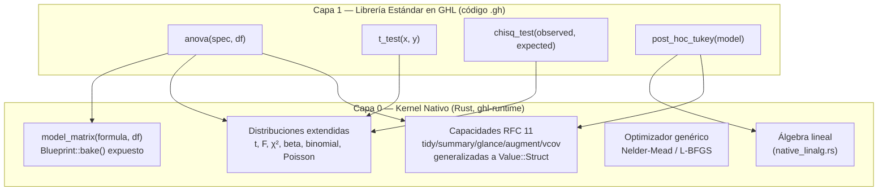

# RFC 15: Kernel de Primitivas y Librería Estándar Auto-Alojada
## De Qué Cuelga el Resto del Lenguaje

> *"Un gato no necesita que le enseñen a cazar cada presa por separado: aprende a saltar, a acechar y a calcular la distancia una sola vez, y el resto es repetición de lo mismo."*

- **Versión**: 0.1.0 (Propuesta)
- **Estado**: En Diseño
- **Área**: Arquitectura de Runtime / Librería Estándar Auto-Alojada / Kernel de Primitivas
- **Dependencias**: [RFC 11](11-neko-statistical-modeling-framework.md), [RFC 04](04-standard-library-and-primitives.md), [RFC 14](14-statistical-contracts-and-expectation-protocols.md)
- **Tributo**: Honra la destreza felina de Gojo & Haru (aprender las primitivas fundamentales una sola vez, ejecutar con precisión y elegancia).

---

## 1. Motivación y Diagnóstico

El backlog de estimadores (TODO.md, Parte E) creció listando procedimientos estadísticos por nombre — ANOVA, LCA, regresión cuantílica, series de tiempo — sin antes decidir **dónde vive cada uno**. Sin ese criterio, el patrón por defecto es "cada estimador nuevo es un módulo Rust nuevo" (el camino que siguieron `neko.rs`, `glm.rs`, `gmm.rs`), lo cual no escala: convierte a GHL en una colección de bindings nativos con sintaxis de lenguaje encima, no en un lenguaje que puede describirse a sí mismo.

Auditoría del estado actual, con evidencia concreta:

1. **`std::*` está cerrado 100% a Rust nativo.** `ghl-runtime::modules::lookup_module_item` resuelve todo contra `PRELUDE_ENV`, que solo contiene `Value::NativeFn`/`NativeFnCtx` ([modules.rs](../../crates/ghl-runtime/src/modules.rs)). No existe ningún mecanismo para que un módulo `std::*` esté respaldado por código `.gh`.
2. **El constructor de matriz de diseño no es una primitiva independiente.** `Blueprint::bake()` ([neko.rs:150](../../crates/ghl-runtime/src/neko.rs)) vive enterrado dentro de `fit_ols`/`fit_logistic`. Un script GHL no puede pedir "dame la matriz de diseño de esta fórmula" sin pasar por un ajuste completo.
3. **El catálogo de distribuciones expuesto es mínimo.** Solo existen `normal_pdf`/`normal_cdf`/`gamma_pdf`/`gamma_cdf` ([env.rs:244-247](../../crates/ghl-runtime/src/env.rs)). No hay $t$, $F$, $\chi^2$, beta, binomial ni Poisson en ninguna forma.
4. **No existe optimizador genérico.** Cada estimador iterativo (IRLS de `fit_logistic`, EM de `fit_gmm`) trae su propio bucle hardcodeado; no hay un `optim()`/`nelder_mead()`/`lbfgs()` de propósito general.
5. **La fragmentación de familias en GLM fue una decisión deliberada, no un descuido** ([native_neko_ops.rs:46-50](../../crates/ghl-runtime/src/native_neko_ops.rs)): OLS y logística no comparten una función genérica porque sus diagnósticos ($R^2$ vs. pseudo-$R^2$) no son intercambiables. Esto importa para la Sección 4: no todo puede bajar a una sola capa.

**Prueba de concepto — ANOVA:** un ANOVA de un factor es, hoy, expresable en más de un 90% con lo ya existente: `fit(y ~ grupo, df)` entrega residuos, suma de cuadrados residual y $R^2$ vía `glance()`/`augment()`. Lo único que falta para obtener el $p$-valor del estadístico $F$ es su CDF, que no existe. Un solo primitivo ausente bloquea un análisis clásico completo de ser ciudadano de GHL en lugar de Rust nativo.

---

## 2. Arquitectura Propuesta: Motor (Capa 0) + Librería Estándar en GHL (Capa 1)

> ### 🦀 / 🐱 La Regla de Oro de División de Responsabilidades:
> - **En Rust (Capa 0) vive EXCLUSIVAMENTE la matemática pesada:** computación numérica de bajo nivel intensiva, estabilidad de punto flotante, vectorización SIMD y algoritmos iterativos masivos $O(N \times \text{iter})$ (descomposiciones matriciales con `faer`, solvers de optimización `optim`, descenso por coordenadas, proyecciones de centrado por medias de alta dimensión, distribuciones de `statrs` y el constructor `model_matrix`).
> - **En GHL (Capa 1) vive TODO EL RESTO:** la API pública de los estimadores (`sem`, `feols`, `iv_regress`, `lasso`, `anova`, `t_test`), la orquestación del flujo analítico, los `struct` de resultados (`AnovaResult`, `SemResult`), las capacidades (`impl` de `tidy`, `glance`, `summary`, `augment`, `vcov`), la inferencia asintótica (errores estándar, p-valores, intervalos de confianza), los diagnósticos y las librerías del ecosistema como `spring_pact`.

Este RFC extiende el pipeline canónico de [RFC 11](11-neko-statistical-modeling-framework.md) (`ModelSpec` → `Blueprint` → `FittedModel` → Capacidades) con un eje ortogonal: **quién implementa el `Estimator Solver` y dónde vive la lógica analítica**.



Hoy solo existe la Capa 0, y solo para tres familias (OLS, logística, GMM), cada una con su propio camino cerrado de extremo a extremo. La Capa 1 no existe como concepto de lenguaje — ni siquiera hay un ejemplo de librería GHL que la habite (`spring_pact`, Parte C del TODO, será la primera, pero para contratos de datos, no para modelado).

---

## 3. El Hallazgo Clave: GHL Ya Tiene el Mecanismo de Extensión

Antes de proponer una nueva feature de lenguaje, verifiqué si hacía falta una. **No hace falta.** GHL ya soporta `struct`/`trait`/`impl` (`test_parse_struct_trait_and_impl`, [parser.rs:1705](../../crates/ghl-syntax/src/parser.rs)), y el intérprete ya resuelve el envío de métodos por nombre de tipo con fallback a función global:

```rust
// eval.rs:401-411 — despacho de `valor.metodo(args)`
} else if let Value::Struct { ref name, .. } = target_val {
    let method_key = format!("{}::{}", name, field);
    let fn_val = self.env.get(&method_key).or_else(|| self.env.get(field))...
```

Y ya existe `Value::NativeFnCtx(fn(&mut Interpreter, Vec<Value>) -> Result<Value, Diagnostic>)` ([value.rs:230](../../crates/ghl-runtime/src/value.rs)), usado hoy por `map()`, `grad()`, `diff()` y `arena::scope()` ([native_core.rs:588](../../crates/ghl-runtime/src/native_core.rs)) precisamente para que una función nativa pueda invocar código GHL de vuelta.

**Propuesta concreta:** convertir `tidy`/`summary`/`glance`/`augment`/`predict`/`residuals`/`vcov`/`coef` de `NativeFn` a `NativeFnCtx`, agregando un brazo de despacho más:

```rust
pub(crate) fn native_tidy(interp: &mut Interpreter, args: Vec<Value>) -> Result<Value, Diagnostic> {
    match &args[0] {
        Value::ModelFit(m) => Ok(m.tidy()),
        Value::GlmFit(m) => Ok(m.tidy()),
        Value::GmmFit(m) => Ok(m.tidy()),
        Value::Struct { name, .. } => {
            let method = interp.env.get(&format!("{name}::tidy")).ok_or_else(|| /* ... */)?;
            interp.call_value(method, vec![args[0].clone()])
        }
        other => Err(/* ... */),
    }
}
```

Cero features nuevas de lenguaje: se reutiliza maquinaria ya probada. Un `struct AnovaResult { ... }` con `impl AnovaResult { fn tidy(&self) -> DataFrame { ... } }` queda **indistinguible en el call-site** (`tidy(result)`) de un modelo 100% nativo:

```ghl
// Canonical Layer 1 self-hosted estimator in pure GHL:
struct AnovaResult {
    df_table: DataFrame,
    f_stat: f64,
    p_value: f64,
}

impl AnovaResult {
    fn tidy(&self) -> DataFrame {
        self.df_table
    }

    fn glance(&self) -> DataFrame {
        dataframe {
            f_statistic: [self.f_stat],
            p_value: [self.p_value]
        }
    }
}
```

---

## 4. Capa 0: Qué Debe Ser Kernel Nativo

| Primitiva | Estado actual | Por qué debe ser nativa |
| :--- | :--- | :--- |
| Álgebra lineal | Existe (`native_linalg.rs`) | Estabilidad numérica (pivoteo, descomposiciones en `faer`) no delegable a un intérprete tree-walking. |
| `model_matrix(formula, df)` | No expuesta — atrapada en `fit_ols` | Reutiliza `Blueprint::bake()`. Retorna `{ x: Matrix, y: Vector, terms: [String], disposition: [RowDisposition] }`. Es la desbloqueadora de mayor apalancamiento. |
| Fórmulas multiparte (`\|`) | Sintaxis solo para lambdas (`\|x\|`) | Permite parsear particiones estructurales (`lhs ~ rhs \| fe \| instruments`), fundamental para `feols` e `iv_regress`. |
| Distribuciones probabilísticas (`std::prob`) | Solo normal/gamma parcial en `env.rs` | `statrs = "0.19.1"` y `rand_xoshiro` ya están en el workspace. Requiere exponer la cuádruple interfaz canónica (`pdf`/`pmf`, `cdf`, `quantile`/`inv_cdf`, `sample` con seed reproducible) para continuas ($t$, $F$, $\chi^2$, Normal, Gamma, Beta, Uniforme, Exponencial) y discretas (Binomial, Poisson). |
| Optimizador genérico (Nelder-Mead / L-BFGS) | No existe | `autodiff.rs` ya calcula gradientes exactos (`eval_vector_gradient`). Solo falta el bucle de convergencia nativo en Rust. Bloquea SEM, LCA y NLS. |
| Capacidades RFC 11 sobre `Value::Struct` | No — cerradas a 3 variantes de Rust | Es el puente hacia la Capa 1 (Sección 3): despachar `tidy(s)` hacia `s.tidy()`. |
| Bucle EM / IRLS como *motor* reusable (no solo resultado) | Hardcodeado por familia (`glm.rs`, `gmm.rs`) | Cada familia decide su propia mecánica; ver Sección 6 sobre por qué esto no siempre debe unificarse. |

---

## 5. Capa 1: Qué Debería Vivir en GHL

### A. Canon Representativo del Core (`std::stats` y `std::prob`)

El núcleo oficial de GHL debe alojar **únicamente** los estimadores y abstracciones canónicas que ejercitan los fundamentos de sintaxis, fórmulas, matrices y contratos del lenguaje:

| Estimador / Subsistema | Dominio | Razón de Permanencia en el Core |
| :--- | :--- | :--- |
| `std::prob` (Normal, StudentT, ChiSq, FisherF, etc.) | Inferencia & Probabilidad | Cuádruple interfaz (`pdf`, `cdf`, `quantile`, `sample`), tests de hipótesis ($t$, $F$, $\chi^2$), p-valores e intervalos de confianza. |
| `ols`, `logistic`, `poisson` | Regresión Clásica / GLM | Ejercita matrices de diseño `model_matrix`, álgebra lineal `faer` e IRLS. |
| `sem(spec, df)` | Ecuaciones Estructurales | Ejercita el DSL léxico y sintáctico específico (`=~`, `~~`, `sem_spec { ... }`) y minimización $F_{ML}$. |
| `feols(y ~ x \| fe, df)` | Efectos Fijos de Alta Dimensión | Ejercita el operador de partición `\|` en fórmulas y la proyección *Within* / FWL en matrices. |
| `iv_regress(y ~ x \| z, df)` | Variables Instrumentales (2SLS) | Ejercita el operador de partición `\|` y composición modular de etapas OLS 100% en GHL. |
| `lasso`, `ridge`, `elastic_net` | Regresión Regularizada | Ejercita el algoritmo de descenso por coordenadas y matrices con penalizaciones $L_1/L_2$. |
| `anova(formula, df)`, `manova` | Descomposición de Varianza | Ejercita contrastes de diseño, tablas F y `std::prob` en GHL puro. |

### B. Ecosistema de Paquetes Externos (Comunidad / Plugins vía `ghl new`)

Para mantener el compilador ligero y enfocado, **todo análisis hiperespecializado se construye como librería externa en código `.gh` puro**, utilizando la CLI de paquetes (`ghl new`, `ghl fetch`, `ghl test`):

- **`ghl-causal`:** Inferencia causal moderna (DiD multi-período Callaway-Sant'Anna, Control Sintético, Regresión Discontinua RDD, Propensity Score Matching).
- **`ghl-timeseries`:** Series temporales avanzadas (Filtro de Kalman, ARIMA/SARIMA, modelos de volatilidad GARCH, modelos VAR).
- **`ghl-survival`:** Análisis de supervivencia y tiempos de falla (curvas Kaplan-Meier, modelos de riesgos proporcionales de Cox).
- **`ghl-panel`:** Modelos de panel dinámico (estimadores GMM de Arellano-Bond y Blundell-Bond).
- **`ghl-multilevel`:** Modelos mixtos y jerárquicos con efectos aleatorios agrupados.

---

## 6. Criterio de Decisión

Antes de escribir o incorporar un estimador, responder en orden:

1. **¿Requiere sintaxis o extensiones dedicadas en el compilador (ej. `=~`, `~~`, `\|`)?** → Debe formar parte del canon representativo de GHL.
2. **¿Su bucle interno es $O(n \cdot \text{iteraciones})$ o peor, sobre datasets grandes?** → Capa 0 (Kernel Rust).
3. **¿Necesita estabilidad numérica especializada (pivoteo, factorizaciones, precisión extendida)?** → Capa 0 (Kernel Rust).
4. **¿Es un método estándar fundamental de inferencia o probabilidad?** → Capa 1 de `std::stats` / `std::prob`.
5. **¿Es un método econométrico o bioestadístico hiperespecializado?** → Paquete del ecosistema GHL en código `.gh` puro distribuido vía `ghl.toml`.

---

## 7. Plan de Fases (propuesto, sincronizado con TODO.md)

1. **Fase 1 — Habilitar el puente:**
   - Exponer `model_matrix(formula, df)`.
   - Extender el parser de fórmulas para admitir particiones con `\|` (`FormulaParts`).
   - Completar el subsistema de distribuciones probabilísticas (`statrs` + `rand_xoshiro`) con la cuádruple interfaz (`pdf`, `cdf`, `quantile`, `sample`).
   - Convertir `tidy`/`summary`/`glance`/`augment`/`vcov` a `NativeFnCtx` con fallback a `Value::Struct`.
2. **Fase 2 — Piloto end-to-end:** implementar `anova()` y tests de hipótesis ($t$, $\chi^2$, $F$) **en GHL puro** sobre la Fase 1, como validación práctica del patrón de auto-alojamiento.
3. **Fase 3 — Optimizador genérico:** implementar Nelder-Mead y L-BFGS en Capa 0 sobre `autodiff.rs`; desbloquea SEM (solver Wishart ML), LCA y NLS.
4. **Fase 4 — Despliegue de estimadores canónicos** (`feols`, `iv_regress`, `lasso`) y empaquetado del ecosistema externo mediante `ghl new`.

---

## 8. Preguntas Abiertas y Respuestas Arquitectónicas

- **¿Alcanza el despacho dinámico por nombre de struct (Sección 3), o hace falta un trait bound estático?**
  - *Respuesta:* Para la Fase 1 y 2, el despacho dinámico en el intérprete (`eval.rs:401-411` y fallback en `native_neko_ops.rs`) alcanza 100% y respeta la regla de "No a la sobreingeniería" de [AGENT.md](../../AGENT.md). En una fase posterior se puede enriquecer `ghl check` con validación estática de traits.
- **¿La librería piloto de Capa 1 (ANOVA, tests) es un módulo nuevo o se integra al preludio?**
  - *Respuesta:* Se integra de forma natural en `std::stats` (`std::stats::anova`), manteniendo la coherencia del estándar de GHL.
- **¿`spring_pact` (Parte C) y esta librería estadística comparten infraestructura de empaquetado?**
  - *Respuesta:* Sí, comparten exactamente la misma infraestructura. `ghl new`, `ghl fetch`, `ghl test` y el manifiesto `ghl.toml` con `ghl.lock` (SHA-256) ya están implementados en `crates/ghl-cli/src/package.rs`. Tanto `spring_pact` como cualquier librería de modelado en Capa 1 se empaquetan y distribuyen con la misma CLI.
