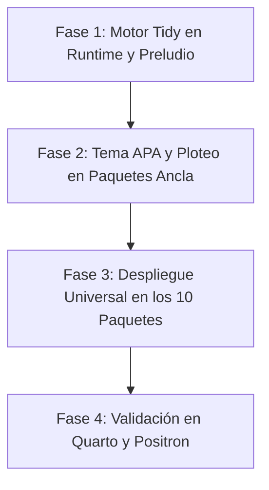

# RFC 17: Protocolo Universal de Modelos Estadísticos, Ecosistema Tidy y Visualización Analítica
## Estandarización de Modelos (`tidy`, `glance`, `augment`) y Gramática Visual de Dominio

- **Versión**: 0.5.0
- **Estado**: Aprobado por el Usuario / En Planificación de Implementación
- **Área**: Ecosistema de Paquetes / Runtime / Visualización Científica / Ergonomía
- **Dependencias**: [RFC 02](02-type-system-and-semantics.md), [RFC 11](11-neko-statistical-modeling-framework.md), [RFC 12](12-cockpit-deck-telemetry-and-diagnostics.md), [RFC 16](16-reactive-typed-grammar-of-graphics.md)
- **Tributo**: David Robinson (*broom*), Hadley Wickham (*modelr*, *ggplot2*), y Terry Therneau (*survival*).

---

## Tabla de Contenidos

1. [Resumen Ejecutivo y Visión](#1-resumen-ejecutivo-y-visión)
2. [Diagnóstico Actual en `packages/*`](#2-diagnóstico-actual-en-packages)
3. [Decisión Arquitectónica: Despacho Polimórfico en Preludio (Opción B)](#3-decisión-arquitectónica-despacho-polimórfico-en-preludio-opción-b)
4. [Especificación del Protocolo Tidy (broom para GHL)](#4-especificación-del-protocolo-tidy-broom-para-ghl)
5. [Especificación del Sistema Visual: Estándar APA y Conciencia de Entorno](#5-especificación-del-sistema-visual-estándar-apa-y-conciencia-de-entorno)
6. [Presentación en Terminal: Cockpit Deck Canónico con `ghl-diagnostics`](#6-presentación-en-terminal-cockpit-deck-canónico-con-ghl-diagnostics)
7. [Catálogo de Implementación por Paquete](#7-catálogo-de-implementación-por-paquete)
8. [Plan de Trabajo Detallado (Milestone v0.5.0)](#8-plan-de-trabajo-detallado-milestone-v050)

---

## 1. Resumen Ejecutivo y Visión

**Tesis.** En un entorno de computación científica maduro, el ajuste de un modelo estadístico no es el paso final del análisis; es el punto de partida de la exploración. El usuario necesita dos capacidades fundamentales e inmediatas tras ejecutar `fit`:
1. **Inspección Numérica Composicional:** Convertir parámetros, incertidumbres y diagnósticos globales en `DataFrame`s limpios y tipados para encadenar con tuberías `|>`, filtrar, ordenar y contrastar sin parsear texto ni desempaquetar campos heterogéneos.
2. **Inspección Visual Reactiva:** Generar con una sola llamada (`plot(fit)`) gráficos estándar de publicación (curvas de supervivencia, trayectorias de event studies, abanicos de predicción ARIMA, curvas psicométricas ICC), totalmente integrados con la gramática de gráficos [RFC 16 (`ghl_plot`)](16-reactive-typed-grammar-of-graphics.md).

Este RFC establece el **Protocolo Universal de Modelos** para los 10 paquetes de GHL (`ghl_survival`, `ghl_causal`, `ghl_irt`, `ghl_timeseries`, `ghl_panel`, `ghl_multilevel`, `spring_pact`, `ghl_optim`, `ghl_impute`, `ghl_db`), consolidando:
- `tidy(model) -> DataFrame`: Tabla de coeficientes, errores estándar, estadísticos y valores $p$.
- `glance(model) -> DataFrame`: Tabla de exactamente 1 fila con bondad de ajuste global ($R^2$, AIC, BIC, logLik, nobs).
- `augment(model, data) -> DataFrame`: Datos observacionales aumentados con predicciones (`.fitted`), errores (`.se_fit`) y residuos (`.resid`).
- `plot(model, ...) -> Plot`: Gráfico composicional de primera clase listo para el visor de Positron, SVG o Vega-Lite, estilizado bajo la norma **APA 7ma edición** por defecto.

---

## 2. Diagnóstico Actual en `packages/*`

Actualmente, cada uno de los 10 paquetes implementa su propia estructura de resultados validada numéricamente:
- `ghl_survival`: produce `KmResult` y `CoxResult`.
- `ghl_causal`: produce `DidResult`, `EventStudyResult` y `SynthResult`.
- `ghl_irt`: produce `IrtModel` con matrices de coeficientes y trazas MHRM.
- `ghl_timeseries`: produce `ArimaResult`, `GarchResult` y `VarResult`.
- `ghl_panel`: produce `PanelResult` (FE, RE, Arellano-Bond).

### Problemas Detectados:
1. **Nombres de campos discordantes:** Algunos structs exponen `.coefs`, otros `.betas`, otros `.estimates`. Un script no puede iterar o comparar modelos de diferentes familias de forma genérica.
2. **Desconexión con DataFrames:** Para graficar un resultado o filtrar coeficientes significativos, el usuario debe extraer vectores manualmente y construir un `dataframe { ... }` a mano.
3. **Ausencia de gráficos automáticos:** Aunque existe el motor `ghl_plot`, los paquetes no lo invocan directamente. El usuario debe reconstruir manualmente las geometrías paso a paso.

---

## 3. Decisión Arquitectónica: Despacho Polimórfico en Preludio (Opción B)

Se adopta formalmente la **Alternativa B**: despacho dinámico y polimórfico con funciones de preludio de primer orden.

### 3.1. Funciones Globales en el Preludio de GHL
El runtime inyecta en el ámbito global las funciones universales:
- `tidy(model, conf_int = true, conf_level = 0.95)`
- `glance(model)`
- `augment(model, data = None)`
- `plot(model, ...)`

### 3.2. Mecanismo de Despacho
Cada struct que represente el resultado de un modelo expone sus métodos internos canónicos (`.tidy()`, `.glance()`, `.augment()`, `.plot()`).
1. La función libre de preludio `tidy(m)` delega internamente a `m.tidy()`.
2. Esto permite la sintaxis dual idéntica a R:
   ```ghl
   // Sintaxis funcional directa:
   let t = tidy(fit);

   // Sintaxis en tubería composicional:
   fit |> tidy() |> filter(p_value < 0.05);
   ```
3. Si un tipo de dato no implementa el protocolo, el compilador/runtime emite un diagnóstico ergonómico:
   ```text
   error[E0501]: type 'CustomStruct' does not implement the Tidy model protocol
     --> script.gh:12:10
      |
   12 | fit |> tidy()
      |        ^^^^^^ type 'CustomStruct' missing '.tidy()' method
      = help: verify that 'CustomStruct' is an estimated model from a GHL statistical package
   ```

---

## 4. Especificación del Protocolo Tidy (broom para GHL)

Los nombres de columnas se adhieren **estrictamente al estándar internacional en inglés** para garantizar máxima interoperabilidad con scripts y literatura científica.

### 4.1. `tidy(model, conf_int = true, conf_level = 0.95) -> DataFrame`
Estandariza los parámetros del modelo en un DataFrame con columnas canónicas estrictas:

| Columna | Tipo | Descripción | Ejemplo |
| :--- | :--- | :--- | :--- |
| `term` | `String` / `Factor` | Nombre del parámetro, covariable o contraste | `"age"`, `"trt1"` |
| `estimate` | `f64` | Estimación puntual del coeficiente ($\hat{\beta}$) | `0.4512` |
| `std_error` | `f64` | Error estándar asintótico o robusto | `0.0891` |
| `statistic` | `f64` | Estadístico de prueba ($t$, $z$, o Wald) | `5.064` |
| `p_value` | `f64` | Valor $p$ bilateral | `0.00004` |
| `conf_low` | `f64` | Límite inferior del intervalo de confianza al nivel dado | `0.2765` |
| `conf_high` | `f64` | Límite superior del intervalo de confianza al nivel dado | `0.6259` |

### 4.2. `glance(model) -> DataFrame`
Resume la bondad de ajuste y métricas globales en un DataFrame de **exactamente 1 fila**:

| Columna | Tipo | Descripción | Aplicabilidad |
| :--- | :--- | :--- | :--- |
| `nobs` | `i64` | Número de observaciones efectivas | Universal |
| `r_squared` | `f64` | Coeficiente de determinación $R^2$ | OLS, Panel, Multilevel |
| `adj_r_squared`| `f64` | $R^2$ ajustado por grados de libertad | OLS, Panel |
| `log_lik` | `f64` | Log-verosimilitud del modelo | MLE, GLM, Cox, IRT, ARIMA |
| `aic` | `f64` | Criterio de Información de Akaike | Modelos probabilísticos |
| `bic` | `f64` | Criterio de Información Bayesiano | Modelos probabilísticos |
| `deviance` | `f64` | Desviación del modelo residual | GLM, Cox |
| `sigma` | `f64` | Desviación estándar de los residuos | OLS, Modelos gaussianos |

### 4.3. `augment(model, data = None) -> DataFrame`
Toma el DataFrame original de ajuste (o nuevos datos si se pasan) y añade columnas calculadas prefijadas con un punto `.`:
- `.fitted`: Valor ajustado / probabilidad predicha $\hat{y}_i$.
- `.se_fit`: Error estándar de la predicción puntual.
- `.resid`: Residuo observacional ($y_i - \hat{y}_i$, martingala, deviance).
- `.hat`: Valores de la diagonal de la matriz sombrero (leverage).

---

## 5. Especificación del Sistema Visual: Estándar APA y Conciencia de Entorno

Siguiendo las decisiones del usuario, la estética visual se rige bajo **principios sobrios, neutrales y estandarizados (APA 7ma edición)**, distinguiendo entre visualización interactiva y exportación a medios impresos.

### 5.1. Reglas de Estilo Visual (Estándar APA por Defecto)
1. **Líneas de Rejilla Menores Desactivadas:** Los gráficos no muestran rejillas secundarias saturadas (`minor grid lines = disabled`).
2. **Rejilla Mayor Ultraligera o Ausente:** Solo líneas sutiles de referencia (`#f0f0f2`) o eje cartesiano limpio sin ruido visual.
3. **Fondo Neutro:** Fondo base blanco `#ffffff` o neutro de alta legibilidad.
4. **Líneas de Ejes Nítidas:** Ejes X e Y sólidos y definidos con marcas de graduación (*ticks*) sobrias hacia afuera.
5. **Paleta Accesible:** Colores discretos basados en la paleta Okabe-Ito (distinguible para daltonismo y legible en escala de grises para fotocopias o impresión en blanco y negro).

### 5.2. Separación Estricta entre Modo Interactivo y Exportación
- **Modo Interactivo (Positron / VS Code):**
  - Si el usuario tiene el IDE en tema oscuro, el visor de gráficos interactivo adapta el lienzo temporalmente para una lectura cómoda y sin fatiga visual.
- **Modo Exportación (Inmutable APA):**
  - Al invocar `.to_svg("fig.svg")`, `.to_png()`, o al renderizar en **Quarto (`.qmd`)**, el renderizado utiliza **SIEMPRE el tema APA claro/neutro de publicación por defecto**, independientemente de si el usuario tenía el editor en tema oscuro.
  - Esto previene el clásico error de que un paper o reporte académico salga con fondo negro o textos invisibles al compilar a PDF/HTML.

### 5.3. Composabilidad Total con `ghl_plot`
La función `plot(model, ...)` devuelve un objeto `Plot` [RFC 16](16-reactive-typed-grammar-of-graphics.md). El usuario puede personalizarlo libremente sumando capas o cambiando el tema:
```ghl
let km = fit_km(Surv(time, event) ~ group, cancer_data);

// 1. Gráfico estándar APA automático:
plot(km);

// 2. Personalización con capas adicionales:
plot(km)
    + labs(title = "Análisis de Supervivencia Global", x = "Seguimiento (meses)")
    + theme_minimal();
```

---

## 6. Presentación en Terminal: Cockpit Deck Canónico con `ghl-diagnostics`

Siguiendo la directriz de **no inventar mecanismos ad-hoc**, los resúmenes de texto de los modelos (`summary(model)`) reutilizan directamente la infraestructura existente en [`crates/ghl-diagnostics`](crates/ghl-diagnostics/src/panel.rs):

### 6.1. Componentes Reutilizados
1. **`CockpitPanel`:** Cabeceras con marcos redondeados Unicode (`╭─ ... ─╮`), título del paquete, y el badge temático con Haru o Gojo:
   - `/ᐠ˵- ⩊ -˵マ ✧ MODEL CONVERGED`
2. **`CockpitTable`:** Para la tabla de coeficientes, reutiliza el alineador de columnas con padding uniforme y códigos de significancia estándar:
   ```text
   ╭─ GHL Survival: Kaplan-Meier & Cox PH ──────── /ᐠ˵- ⩊ -˵マ ✧ ESTIMATED ─╮
   │ Observations: 228       Events: 165        Log-Lik: -742.82             │
   │ Wald Test: 32.14 on 3 df (p = 4.88e-7)     Concordance: 0.637           │
   ├─────────────────────────────────────────────────────────────────────────┤
   │ Term         Estimate   Std. Error   Statistic    p-value               │
   │ age          0.0187     0.0092       2.032        0.0421    *           │
   │ sex_male    -0.5310     0.1672      -3.176        0.0015    **          │
   │ ph_ecog      0.4631     0.1147       4.037        5.41e-5   ***         │
   ╰─────────────────────────────────────────────────────────────────────────╯
   Signif. codes:  0 '***' 0.001 '**' 0.01 '*' 0.05 '.' 0.1 ' ' 1
   ```

---

## 7. Catálogo de Implementación por Paquete

| Paquete | Qué devuelve `tidy()` | Qué genera `plot(model)` |
| :--- | :--- | :--- |
| **`ghl_survival`** | Coeficientes Cox PH (HR, errores, p-valores, intervalos 95%). | Curva Kaplan-Meier escalonada con bandas Greenwood e indicador de censuras (`+`). |
| **`ghl_causal`** | Efectos de tratamiento promedio (ATT) y coeficientes dinámicos. | Gráfico de Event Study con $t = -1$ como ancla, intervalo 95% y línea cero. |
| **`ghl_irt`** | Parámetros de ítems discriminación ($a$), dificultad ($b$), adivinanza ($c$). | **(Default)** Curvas Características de Ítems (ICC) o **(Type="tif")** Función de Información. |
| **`ghl_timeseries`** | Coeficientes autorregresivos, medias móviles y varianza. | Serie temporal reciente + proyección con abanicos (*fan chart*) al 80% y 95%. |
| **`ghl_panel`** | Parámetros de efectos fijos / Arellano-Bond con SE robusto. | Forest plot de coeficientes con intervalos de confianza o residuos en el tiempo. |
| **`ghl_multilevel`** | Efectos fijos + componentes de varianza de efectos aleatorios. | Gráfico de interceptos/pendientes aleatorias con intervalos BLUP por grupo. |
| **`ghl_impute`** | Resumen de coeficientes agrupados por reglas de Rubin (1987). | Densidades comparativas: distribución de datos observados vs valores imputados. |
| **`ghl_optim`** | Parámetros calibrados $\theta^*$ con errores asintóticos Hessian. | Traza de convergencia del gradiente y valor de pérdida por iteración. |
| **`spring_pact`** | Reglas evaluadas, estado (Passed/Failed), tolerancias. | Diagrama de barras de cumplimiento de reglas estadísticas y contratos. |
| **`ghl_db`** | Esquema de columnas, tipos y estadísticas de la consulta. | N/A (delega en DataFrames estándar). |

---

## 8. Plan de Trabajo Detallado (Milestone v0.5.0)

El desarrollo se divide en 4 fases secuenciales y verificables:



### Fase 1: Motor Tidy en Runtime y Funciones de Preludio
1. Inyectar `tidy`, `glance`, `augment` y `plot` en el preludio estándar de `crates/ghl-runtime`.
2. Implementar el mecanismo de despacho polimórfico a métodos de structs.
3. Emitir el error descriptivo `E0501` si un tipo no soporta el protocolo.
4. Tests unitarios en el runtime validando la invocación directa y con tuberías `|>`.

### Fase 2: Tema APA y Ploteo en Paquetes Ancla (`ghl_survival` y `ghl_causal`)
1. Implementar `theme_apa()` formalmente en `crates/ghl-plot`.
2. Implementar `.tidy()`, `.glance()` y `.plot()` en `ghl_survival` (Kaplan-Meier con intervalos y Cox PH).
3. Implementar `.tidy()`, `.glance()` y `.plot()` en `ghl_causal` (Event Studies con bandas y DiD).
4. Verificar que `plot(fit)` produzca un `Plot` válido y que se exporte a SVG neutro sin fallos.

### Fase 3: Despliegue Universal en los Paquetes Restantes
1. **`ghl_timeseries`**: Tidy de coeficientes ARIMA/GARCH y `plot()` con fan chart de predicción.
2. **`ghl_irt`**: Tidy de parámetros psicométricos y `plot()` con ICC y TIF.
3. **`ghl_panel` y `ghl_multilevel`**: Tidy de modelos de panel y mixtos con forest plots.
4. **`ghl_impute` y `ghl_optim`**: Tidy de Rubin pooling y MICE; trazas de optimización.
5. **`spring_pact`**: Tidy de contratos de datos.

### Fase 4: Validación Integral en Quarto y Positron
1. Actualizar los cuadernos Quarto oficiales (`examples/*.qmd`) demostrando el nuevo flujo fluido:
   ```ghl
   fit |> tidy() |> filter(p_value < 0.05);
   plot(fit);
   ```
2. Validar que la exportación de documentos Quarto genere figuras claras estilo APA sin importar el tema del editor.
3. Documentar la guía del usuario en `packages/README.md`.
